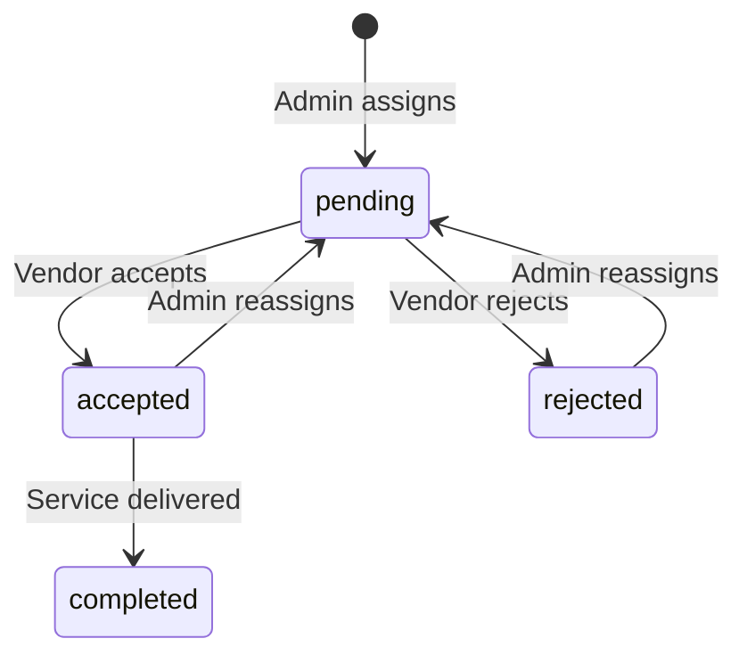

# Admin Booking Assignment Process Documentation

## Table of Contents
1. [Overview](#overview)
2. [System Architecture](#system-architecture)
3. [Booking Management](#booking-management)
4. [Vendor Assignment Process](#vendor-assignment-process)
5. [Database Schema](#database-schema)
6. [API Functions](#api-functions)
7. [UI Components](#ui-components)
8. [Business Rules](#business-rules)
9. [Workflow Examples](#workflow-examples)
10. [Integration Points](#integration-points)

## Overview

The Admin Booking Assignment system is the central control mechanism for managing customer bookings and distributing them to approved vendors. This system enables administrators to:

- View and manage all customer bookings
- Monitor booking statistics and revenue
- Assign bookings to appropriate vendors
- Track assignment status and vendor performance
- Handle booking status updates and payment processing
- Reassign bookings when necessary

### Key Features
- Real-time booking dashboard with comprehensive statistics
- Advanced filtering and search capabilities
- Vendor assignment with notes and tracking
- Status management for bookings and payments
- Bulk operations support
- Export functionality for reporting

## System Architecture

### High-Level Flow

```
Customer Creates Booking
    ↓
Admin Reviews Booking
    ↓
Admin Assigns to Vendor
    ↓
Vendor Accepts/Rejects
    ↓
Vendor Assigns Resources (Driver + Vehicle)
    ↓
Service Delivery
    ↓
Booking Completion
```

### Component Hierarchy

```
/admin/bookings (Main Dashboard)
    ├── Booking Statistics Cards
    ├── Booking Filters
    ├── Bookings Table
    │   └── Individual Booking Actions
    └── /admin/bookings/[id] (Detail View)
        ├── Booking Information
        ├── Customer Details
        ├── Vehicle Requirements
        ├── Assignment Status
        └── Action Controls
```

## Booking Management

### Dashboard Overview

The admin booking dashboard (`/admin/bookings/page.tsx`) provides:

#### Statistics Cards
- **Total Bookings**: All-time booking count
- **Today's Bookings**: New bookings created today
- **Upcoming**: Confirmed bookings with future pickup dates
- **Completed**: Successfully finished bookings
- **Cancelled**: Cancelled booking count
- **Total Revenue**: Sum of completed payment amounts

#### Filtering Options

| Filter | Type | Description |
|--------|------|-------------|
| `search` | Text | Search by booking number, addresses |
| `status` | Select | Filter by booking status (pending/confirmed/completed/cancelled) |
| `paymentStatus` | Select | Filter by payment status |
| `vehicleTypeId` | Select | Filter by vehicle type |
| `dateFrom` | Date | Start date for pickup datetime |
| `dateTo` | Date | End date for pickup datetime |
| `customerId` | UUID | Filter by specific customer |
| `page` | Number | Pagination control |

### Booking Detail View

The detail view (`/admin/bookings/[id]/page.tsx`) displays:

#### Information Sections
1. **Booking Information**
   - Booking number
   - Status badges
   - Pickup date/time
   - Passenger and luggage count

2. **Route Details**
   - Pickup address with zone
   - Dropoff address with zone
   - Distance and duration estimates

3. **Customer Information**
   - Customer profile
   - Contact details
   - Booking history link

4. **Vehicle Requirements**
   - Selected vehicle type
   - Capacity requirements
   - Special amenities

5. **Payment Information**
   - Base price breakdown
   - Amenities pricing
   - Total amount
   - Payment status
   - Transaction details

6. **Assignment Status**
   - Current vendor assignment
   - Assigned driver and vehicle
   - Assignment timeline
   - Status history

## Vendor Assignment Process

### Assignment Creation

The vendor assignment process involves:

1. **Vendor Selection**
   - Admin opens assignment modal
   - System loads approved vendors
   - Admin selects appropriate vendor based on:
     - Location/service area
     - Vehicle availability
     - Performance metrics
     - Current workload

2. **Assignment Details**
   - Optional notes for special instructions
   - Assignment timestamp recorded
   - Admin user ID tracked as `assigned_by`

3. **Database Operations**
   ```typescript
   // Check for existing assignment
   const existingAssignment = await checkExistingAssignment(bookingId)

   if (existingAssignment) {
     // Update existing assignment (reassignment)
     updateAssignment({
       vendor_id: newVendorId,
       status: 'pending',
       notes: assignmentNotes,
       assigned_at: new Date(),
       assigned_by: adminUserId,
       // Reset vendor-side fields
       driver_id: null,
       vehicle_id: null,
       accepted_at: null
     })
   } else {
     // Create new assignment
     createAssignment({
       booking_id: bookingId,
       vendor_id: vendorId,
       status: 'pending',
       notes: assignmentNotes,
       assigned_by: adminUserId
     })
   }
   ```

### Assignment States



### Reassignment Process

Admins can reassign bookings when:
- Vendor rejects the assignment
- Vendor doesn't respond in time
- Quality or performance issues
- Customer requests change

Reassignment maintains history while creating new active assignment.

## Database Schema

### Core Tables

#### bookings Table
```sql
CREATE TABLE bookings (
    id UUID PRIMARY KEY,
    booking_number TEXT UNIQUE NOT NULL,
    customer_id UUID REFERENCES profiles(id),
    vehicle_type_id UUID REFERENCES vehicle_types(id),
    pickup_datetime TIMESTAMPTZ NOT NULL,
    pickup_address TEXT NOT NULL,
    dropoff_address TEXT NOT NULL,
    passenger_count INTEGER NOT NULL,
    luggage_count INTEGER,
    base_price DECIMAL(10,2) NOT NULL,
    amenities_price DECIMAL(10,2) DEFAULT 0,
    total_price DECIMAL(10,2) NOT NULL,
    booking_status TEXT DEFAULT 'pending',
    payment_status TEXT DEFAULT 'pending',
    customer_notes TEXT,
    cancellation_reason TEXT,
    cancelled_at TIMESTAMPTZ,
    stripe_payment_intent_id TEXT,
    paid_at TIMESTAMPTZ,
    created_at TIMESTAMPTZ DEFAULT now(),
    updated_at TIMESTAMPTZ DEFAULT now()
);
```

#### booking_assignments Table
```sql
CREATE TABLE booking_assignments (
    id UUID PRIMARY KEY DEFAULT gen_random_uuid(),
    booking_id UUID NOT NULL REFERENCES bookings(id),
    vendor_id UUID NOT NULL REFERENCES vendor_applications(id),
    driver_id UUID REFERENCES vendor_drivers(id),
    vehicle_id UUID REFERENCES vehicles(id),
    status TEXT NOT NULL DEFAULT 'pending',
    assigned_at TIMESTAMPTZ NOT NULL DEFAULT now(),
    accepted_at TIMESTAMPTZ,
    rejected_at TIMESTAMPTZ,
    completed_at TIMESTAMPTZ,
    notes TEXT,
    rejection_reason TEXT,
    assigned_by UUID REFERENCES users(id),
    created_at TIMESTAMPTZ DEFAULT now(),
    updated_at TIMESTAMPTZ DEFAULT now(),
    UNIQUE(booking_id) -- One active assignment per booking
);
```

### Key Relationships

- `booking_assignments.booking_id` → `bookings.id` (One-to-One active)
- `booking_assignments.vendor_id` → `vendor_applications.id`
- `booking_assignments.assigned_by` → `users.id` (Admin who assigned)
- `booking_assignments.driver_id` → `vendor_drivers.id` (Vendor's assignment)
- `booking_assignments.vehicle_id` → `vehicles.id` (Vendor's assignment)

## API Functions

### Located in `/app/admin/bookings/actions.ts`

#### Booking Retrieval

```typescript
interface BookingFilters {
  search?: string
  status?: 'all' | 'pending' | 'confirmed' | 'completed' | 'cancelled'
  paymentStatus?: 'all' | 'pending' | 'processing' | 'completed' | 'failed' | 'refunded'
  vehicleTypeId?: string
  dateFrom?: string
  dateTo?: string
  customerId?: string
  page?: number
  limit?: number
}

// Get paginated bookings with filters
async function getBookings(filters: BookingFilters): Promise<{
  bookings: BookingWithCustomer[]
  total: number
  page: number
  totalPages: number
}>

// Get detailed booking information
async function getBookingDetails(bookingId: string): Promise<BookingDetail>
```

#### Assignment Management

```typescript
// Get list of approved vendors
async function getAvailableVendors(): Promise<Vendor[]>

// Assign booking to vendor
async function assignBookingToVendor(
  bookingId: string,
  vendorId: string,
  notes?: string
): Promise<{ success: boolean }>

// Get current assignment for booking
async function getBookingAssignment(bookingId: string): Promise<Assignment | null>
```

#### Status Management

```typescript
// Update booking status
async function updateBookingStatus(
  bookingId: string,
  status: 'pending' | 'confirmed' | 'completed' | 'cancelled',
  cancellationReason?: string
): Promise<{ success: boolean }>

// Update payment status
async function updatePaymentStatus(
  bookingId: string,
  status: 'pending' | 'processing' | 'completed' | 'failed' | 'refunded',
  paymentError?: string
): Promise<{ success: boolean }>
```

#### Statistics & Reporting

```typescript
// Get dashboard statistics
async function getBookingStats(): Promise<{
  total: number
  today: number
  upcoming: number
  completed: number
  cancelled: number
  revenue: number
}>

// Export bookings to CSV
async function exportBookingsToCSV(filters: BookingFilters): Promise<string>

// Bulk status updates
async function bulkUpdateBookingStatus(
  bookingIds: string[],
  status: 'confirmed' | 'cancelled'
): Promise<{ success: boolean }>
```

## UI Components

### Main Components

#### BookingsTable Component
**Location**: `/app/admin/bookings/components/bookings-table.tsx`

**Features**:
- Displays booking list with key information
- Status badges with color coding
- Customer information preview
- Route summary
- Payment amount
- Quick actions dropdown
- Assignment status indicator

#### AssignVendorModal Component
**Location**: `/app/admin/bookings/components/assign-vendor-modal.tsx`

**Features**:
- Vendor selection dropdown
- Business location display
- Optional notes field
- Loading states
- Error handling
- Success confirmation

#### BookingDetail Component
**Location**: `/app/admin/bookings/[id]/components/booking-detail.tsx`

**Features**:
- Comprehensive booking information display
- Status update controls
- Payment status management
- Assignment history
- Customer details card
- Route visualization
- Action buttons for operations

#### ClientFilters Component
**Location**: `/app/admin/bookings/components/client-filters.tsx`

**Features**:
- Search input with debouncing
- Status dropdown filters
- Date range pickers
- Vehicle type selector
- Clear filters option
- URL parameter synchronization

### Status Indicators

#### Booking Status Badges
- **Pending**: Gray outline with clock icon
- **Confirmed**: Green with check icon
- **Completed**: Blue with check icon
- **Cancelled**: Red with X icon

#### Payment Status Badges
- **Pending**: Gray outline
- **Processing**: Blue with spinner
- **Completed**: Green with check
- **Failed**: Red with X
- **Refunded**: Orange with alert

#### Assignment Status Badges
- **Pending**: Yellow outline
- **Accepted**: Green
- **Rejected**: Red
- **Completed**: Blue

## Business Rules

### Assignment Eligibility

1. **Vendor Requirements**:
   - Must have `approved` application status
   - Must be active in the system
   - Should have compatible vehicle categories

2. **Booking Requirements**:
   - Cannot be in `cancelled` status
   - Should not have active completed assignment
   - Payment status doesn't block assignment

3. **Reassignment Rules**:
   - Existing assignments are updated, not duplicated
   - Previous vendor's resources are released
   - Assignment history is maintained
   - New `assigned_at` timestamp recorded

### Status Transition Rules

#### Booking Status Transitions
```
pending → confirmed (Admin confirms)
pending → cancelled (Admin/Customer cancels)
confirmed → completed (Service delivered)
confirmed → cancelled (Cancellation allowed)
completed → [terminal state]
cancelled → [terminal state]
```

#### Assignment Status Transitions
```
pending → accepted (Vendor accepts)
pending → rejected (Vendor rejects)
accepted → completed (Service finished)
rejected → pending (Reassignment)
completed → [terminal state]
```

### Validation Rules

1. **Assignment Creation**:
   - Booking must exist
   - Vendor must be approved
   - Admin must be authenticated
   - Only one active assignment per booking

2. **Status Updates**:
   - Cannot update cancelled bookings
   - Cannot reverse completed status
   - Cancellation requires reason
   - Payment completion sets `paid_at`

3. **Data Integrity**:
   - Booking number uniqueness enforced
   - Foreign key constraints maintained
   - Soft deletes preserve history
   - Timestamps auto-updated

## Workflow Examples

### Complete Assignment Flow

```typescript
// 1. Admin views booking list
const bookings = await getBookings({
  status: 'pending',
  page: 1
})

// 2. Admin selects booking for assignment
const bookingId = 'booking-uuid'
const bookingDetails = await getBookingDetails(bookingId)

// 3. Admin retrieves available vendors
const vendors = await getAvailableVendors()

// 4. Admin assigns to vendor
await assignBookingToVendor(
  bookingId,
  'vendor-uuid',
  'Priority customer, please handle with care'
)

// 5. System creates assignment record
// booking_assignments table entry created with:
// - booking_id
// - vendor_id
// - status: 'pending'
// - assigned_at: now()
// - assigned_by: admin_id
// - notes: provided notes

// 6. Vendor receives notification (handled separately)

// 7. Vendor accepts and assigns resources
// (Handled in vendor system - see vendor documentation)

// 8. Admin monitors assignment status
const assignment = await getBookingAssignment(bookingId)
// Returns current assignment with vendor, driver, vehicle details
```

### Handling Vendor Rejection

```typescript
// 1. Vendor rejects assignment
// Assignment status becomes 'rejected'
// rejection_reason recorded

// 2. Admin sees rejected status in dashboard

// 3. Admin reassigns to different vendor
await assignBookingToVendor(
  bookingId,
  'new-vendor-uuid',
  'Previous vendor unavailable, urgent assignment'
)

// 4. System updates existing assignment
// - Sets new vendor_id
// - Resets status to 'pending'
// - Clears driver_id and vehicle_id
// - Updates assigned_at
// - Maintains assignment history
```

### Bulk Operations Example

```typescript
// 1. Admin selects multiple bookings
const selectedBookings = [
  'booking-1-uuid',
  'booking-2-uuid',
  'booking-3-uuid'
]

// 2. Admin confirms bulk action
await bulkUpdateBookingStatus(
  selectedBookings,
  'confirmed'
)

// 3. All selected bookings updated
// - booking_status set to 'confirmed'
// - updated_at refreshed
// - Revalidation triggered
```

### Payment Status Update

```typescript
// 1. Payment webhook received (Stripe)
const paymentIntentId = 'pi_xxxxx'

// 2. Find booking by payment intent
const booking = await findBookingByPaymentIntent(paymentIntentId)

// 3. Update payment status
await updatePaymentStatus(
  booking.id,
  'completed'
)

// 4. System updates:
// - payment_status: 'completed'
// - paid_at: now()
// - Updates statistics
// - Triggers notifications
```

## Integration Points

### Vendor Dashboard Integration

The assignment created by admin appears in vendor dashboard:

1. **Data Flow**:
   ```
   Admin assigns → booking_assignments created
                 → Vendor dashboard queries assignments
                 → Vendor sees pending assignment
                 → Vendor accepts/rejects
                 → Admin sees updated status
   ```

2. **Shared Data**:
   - Assignment status
   - Driver and vehicle assignments
   - Notes and communications
   - Timeline events

3. **Real-time Updates**:
   - Path revalidation on assignment
   - Status changes reflect immediately
   - Both dashboards stay synchronized

### Customer Booking Integration

1. **Customer Visibility**:
   - Assignment status visible to customer
   - Vendor details shown when assigned
   - Driver/vehicle info when available

2. **Status Updates**:
   - Booking status changes notify customer
   - Payment confirmations
   - Service completion

### Payment System Integration

1. **Stripe Integration**:
   - Payment intent creation on booking
   - Webhook handling for status updates
   - Refund processing capabilities

2. **Status Synchronization**:
   - Payment success → Booking confirmation
   - Payment failure → Status update
   - Refund initiated → Payment status change

### Notification System

1. **Email Notifications**:
   - Vendor assignment notification
   - Status change alerts
   - Payment confirmations

2. **In-app Notifications**:
   - Real-time status updates
   - Assignment alerts for vendors
   - Action required indicators

## Error Handling

### Common Error Scenarios

1. **Assignment Failures**:
   ```typescript
   try {
     await assignBookingToVendor(bookingId, vendorId)
   } catch (error) {
     // Handle specific errors:
     // - Vendor not found
     // - Booking already assigned
     // - Database constraint violation
     toast.error('Failed to assign booking')
   }
   ```

2. **Status Update Failures**:
   - Invalid status transition
   - Concurrent modification
   - Permission denied

3. **Data Retrieval Errors**:
   - Network timeouts
   - Invalid filters
   - Database connection issues

### Error Recovery

1. **Retry Mechanisms**:
   - Automatic retry for transient failures
   - Exponential backoff
   - Maximum retry limits

2. **Fallback Strategies**:
   - Cache recent data
   - Show partial information
   - Provide manual refresh

3. **User Communication**:
   - Clear error messages
   - Suggested actions
   - Support contact information

## Performance Considerations

### Query Optimization

1. **Efficient Joins**:
   - Selective column retrieval
   - Proper indexing on foreign keys
   - Limit nested queries

2. **Pagination**:
   - Default 10 items per page
   - Server-side pagination
   - Count queries optimized

3. **Caching Strategy**:
   - Statistics cached with TTL
   - Vendor list cached
   - Path revalidation on updates

### Scalability Measures

1. **Database Indexes**:
   - booking_number (unique)
   - customer_id
   - vendor_id
   - pickup_datetime
   - booking_status, payment_status

2. **Background Jobs**:
   - Bulk operations queued
   - Email notifications async
   - Statistics calculation scheduled

## Security Considerations

### Access Control

1. **Authentication**:
   - Admin role required
   - Session validation
   - Token expiration handling

2. **Authorization**:
   - Role-based permissions
   - Action-level checks
   - Data scope limitations

3. **Audit Trail**:
   - Assignment tracking with assigned_by
   - Status change history
   - Timestamp recording

### Data Protection

1. **Sensitive Information**:
   - Customer PII protected
   - Payment details encrypted
   - Notes sanitized

2. **Input Validation**:
   - SQL injection prevention
   - XSS protection
   - CSRF tokens

## Related Documentation

- [Vendor Driver and Booking Assignment](./vendor-driver-booking-assignment.md)
- [Customer Booking Flow](./customer-booking-flow.md)
- [Payment Processing](./payment-processing.md)
- [Notification System](./notification-system.md)