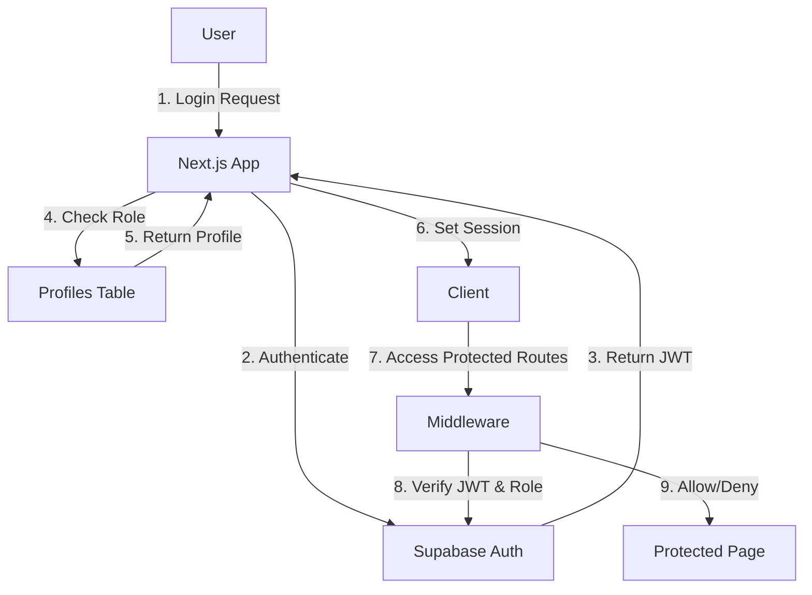
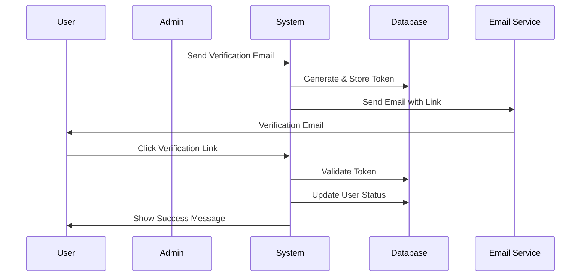

# Authentication and Role Management Documentation

## Table of Contents
1. [Overview](#overview)
2. [Authentication Flow](#authentication-flow)
3. [Role-Based Access Control (RBAC)](#role-based-access-control-rbac)
4. [User Registration](#user-registration)
5. [Login Process](#login-process)
6. [Password Management](#password-management)
7. [Email Verification](#email-verification)
8. [Two-Factor Authentication](#two-factor-authentication)
9. [Session Management](#session-management)
10. [API Security](#api-security)
11. [Database Schema](#database-schema)
12. [Implementation Examples](#implementation-examples)

## Overview

The Vehicle Service application implements a comprehensive authentication and authorization system using Supabase Auth combined with custom role-based access control. The system supports multiple user roles with different permission levels and includes features like email verification, two-factor authentication, and secure session management.

### Key Features
- **Multiple User Roles**: Admin, Vendor, Driver, Customer
- **Email Verification**: Token-based email verification system
- **Password Security**: Secure password reset and recovery
- **Two-Factor Authentication**: Optional 2FA for enhanced security
- **Session Management**: Secure JWT-based sessions
- **Activity Logging**: Comprehensive audit trail

## Authentication Flow

### High-Level Authentication Architecture



### Authentication Providers
- **Email/Password**: Primary authentication method
- **Magic Link**: Passwordless authentication via email
- **OAuth** (Future): Google, GitHub, etc.

## Role-Based Access Control (RBAC)

### User Roles

| Role | Description | Permissions |
|------|-------------|-------------|
| **Admin** | System administrators | Full system access, user management, settings, reports |
| **Vendor** | Service providers | Manage services, view bookings, handle customers |
| **Driver** | Service drivers | View assignments, update status, track routes |
| **Customer** | End users | Book services, view history, manage profile |

### Role Hierarchy
```
Admin
  └── Can manage all users and access all features
Vendor
  └── Can manage their services and assigned drivers
Driver
  └── Can view and update assigned tasks
Customer
  └── Can book services and manage own profile
```

### Permission Matrix

| Feature | Admin | Vendor | Driver | Customer |
|---------|-------|--------|--------|----------|
| User Management | ✅ | ❌ | ❌ | ❌ |
| Service Management | ✅ | ✅ | ❌ | ❌ |
| Booking Management | ✅ | ✅ | ✅ | ✅ |
| Reports & Analytics | ✅ | ✅ | ❌ | ❌ |
| System Settings | ✅ | ❌ | ❌ | ❌ |
| Profile Management | ✅ | ✅ | ✅ | ✅ |

## User Registration

### Registration Flow

1. **User submits registration form**
   ```typescript
   // /app/(auth)/register/page.tsx
   const { error } = await supabase.auth.signUp({
     email: email,
     password: password,
     options: {
       data: {
         full_name: fullName,
         role: 'customer' // Default role
       }
     }
   })
   ```

2. **Trigger creates user profile**
   ```sql
   -- Automatically executed on auth.users insert
   CREATE TRIGGER on_auth_user_created
     AFTER INSERT ON auth.users
     FOR EACH ROW
     EXECUTE FUNCTION handle_new_user();
   ```

3. **Profile created with default values**
   ```sql
   -- handle_new_user() function
   INSERT INTO public.profiles (
     id,
     email,
     full_name,
     role,
     status,
     email_verified
   ) VALUES (
     NEW.id,
     NEW.email,
     NEW.raw_user_meta_data->>'full_name',
     COALESCE(NEW.raw_user_meta_data->>'role', 'customer'),
     'active',
     false
   );
   ```

4. **Verification email sent** (if enabled)

### Registration Endpoints

- **Customer Registration**: `/register`
- **Admin User Creation**: `/admin/users/new`
- **Bulk User Import**: `/admin/users/import`

### Authentication Routes Structure

All user authentication routes are organized using Next.js Route Groups:

```
app/
└── (auth)/                  # Route group - doesn't affect URLs
    ├── login/              # URL: /login
    ├── register/           # URL: /register
    ├── forgot-password/    # URL: /forgot-password
    ├── reset-password/     # URL: /reset-password
    ├── verify-email/       # URL: /verify-email
    ├── logout/             # URL: /logout
    └── unauthorized/       # URL: /unauthorized
```

This structure provides:
- Clean URLs without `/auth/` prefix
- Organized file structure for maintenance
- Easy to add shared layouts or middleware for auth pages

## Login Process

### Standard Login Flow

```typescript
// /app/(auth)/login/actions.ts
export async function userLogin(email: string, password: string) {
  const supabase = createClient()
  
  // 1. Authenticate with Supabase
  const { data, error } = await supabase.auth.signInWithPassword({
    email,
    password,
  })
  
  if (error) {
    return { error: error.message }
  }
  
  // 2. Get user profile with role
  const { data: profile } = await supabase
    .from('profiles')
    .select('role, status')
    .eq('id', data.user.id)
    .single()
  
  // 3. Check user status
  if (profile?.status !== 'active') {
    await supabase.auth.signOut()
    return { error: 'Account is not active' }
  }
  
  // 4. Redirect based on role
  switch (profile?.role) {
    case 'admin':
      redirect('/admin/dashboard')
    case 'vendor':
      redirect('/vendor/dashboard')
    case 'driver':
      redirect('/driver/dashboard')
    default:
      redirect('/dashboard')
  }
}
```

### Protected Route Middleware

```typescript
// /middleware.ts
export async function middleware(request: NextRequest) {
  const { pathname } = request.nextUrl
  
  // Admin routes protection
  if (pathname.startsWith('/admin')) {
    const supabase = createMiddlewareClient(request)
    const { data: { user } } = await supabase.auth.getUser()
    
    if (!user) {
      return NextResponse.redirect(new URL('/login', request.url))
    }
    
    const { data: profile } = await supabase
      .from('profiles')
      .select('role')
      .eq('id', user.id)
      .single()
    
    if (profile?.role !== 'admin') {
      return NextResponse.redirect(new URL('/unauthorized', request.url))
    }
  }
}
```

## Password Management

### Password Reset Flow

1. **User requests password reset**
   ```typescript
   // /app/(auth)/forgot-password/page.tsx
   const { error } = await supabase.auth.resetPasswordForEmail(email, {
     redirectTo: `${process.env.NEXT_PUBLIC_APP_URL}/reset-password`,
   })
   ```

2. **User receives reset email with token**

3. **User submits new password**
   ```typescript
   // /app/(auth)/reset-password/page.tsx
   const { error } = await supabase.auth.updateUser({
     password: newPassword
   })
   ```

### Password Requirements
- Minimum 6 characters
- No maximum length restriction
- No special character requirements (Supabase default)
- Password strength indicator recommended

### Admin Password Reset
Admins can trigger password reset emails for users:

```typescript
// /app/admin/users/actions/user-auth.actions.ts
export async function sendPasswordResetEmail(email: string) {
  const { error } = await supabase.auth.resetPasswordForEmail(email, {
    redirectTo: `${process.env.NEXT_PUBLIC_APP_URL}/reset-password`,
  })
}
```

## Email Verification

### Verification System Architecture



### Verification Token Schema

```sql
CREATE TABLE email_verification_tokens (
  id UUID PRIMARY KEY,
  user_id UUID REFERENCES profiles(id),
  token TEXT UNIQUE,
  expires_at TIMESTAMPTZ,
  created_at TIMESTAMPTZ DEFAULT NOW(),
  used_at TIMESTAMPTZ
);
```

### Verification Process

1. **Admin sends verification email**
   ```typescript
   export async function sendVerificationEmail(userId: string) {
     // Generate secure token
     const token = crypto.randomBytes(32).toString('hex')
     
     // Store in database with 24hr expiry
     await supabase.from('email_verification_tokens').insert({
       user_id: userId,
       token,
       expires_at: new Date(Date.now() + 24 * 60 * 60 * 1000)
     })
     
     // Send email (integrate with email service)
     const verificationUrl = `${APP_URL}/verify-email?token=${token}`
   }
   ```

2. **User clicks verification link**
   ```typescript
   // /app/(auth)/verify-email/page.tsx
   const { data: result } = await supabase
     .rpc('verify_email_with_token', { p_token: token })
   ```

3. **System updates user status**
   ```sql
   UPDATE profiles 
   SET email_verified = true, 
       email_verified_at = NOW() 
   WHERE id = user_id;
   ```

### Bulk Verification
Admins can send verification emails to multiple users:

```typescript
export async function bulkSendVerificationEmails(userIds: string[]) {
  for (const userId of userIds) {
    await sendVerificationEmail(userId)
  }
}
```

## Two-Factor Authentication

### 2FA Implementation

Currently, 2FA is tracked via a boolean flag in the profiles table:

```sql
ALTER TABLE profiles 
ADD COLUMN two_factor_enabled BOOLEAN DEFAULT false;
```

### Enabling/Disabling 2FA

```typescript
// Admin can toggle 2FA for users
export async function toggleUser2FA(userId: string, enable: boolean) {
  await supabase
    .from('profiles')
    .update({ two_factor_enabled: enable })
    .eq('id', userId)
}
```

### Future 2FA Implementation
- TOTP (Time-based One-Time Password)
- SMS verification
- Backup codes
- Authenticator app integration

## Session Management

### Session Configuration

```typescript
// Supabase session configuration
const supabase = createClient({
  auth: {
    autoRefreshToken: true,
    persistSession: true,
    detectSessionInUrl: true
  }
})
```

### Session Lifecycle

1. **Session Creation**: On successful login
2. **Session Refresh**: Automatic token refresh before expiry
3. **Session Validation**: On each protected route access
4. **Session Termination**: On logout or expiry

### Logout Process

```typescript
// /app/(auth)/logout/route.ts
export async function GET() {
  const supabase = await createClient()
  await supabase.auth.signOut()
  redirect('/login')
}
```

## API Security

### Authentication Headers

All API requests must include authentication:

```typescript
// Authenticated API request
const response = await fetch('/api/users', {
  headers: {
    'Authorization': `Bearer ${session.access_token}`,
    'Content-Type': 'application/json'
  }
})
```

### API Route Protection

```typescript
// /app/api/admin/users/route.ts
export async function GET(request: Request) {
  const supabase = createClient()
  
  // Verify authentication
  const { data: { user }, error } = await supabase.auth.getUser()
  if (!user) {
    return NextResponse.json({ error: 'Unauthorized' }, { status: 401 })
  }
  
  // Verify role
  const { data: profile } = await supabase
    .from('profiles')
    .select('role')
    .eq('id', user.id)
    .single()
  
  if (profile?.role !== 'admin') {
    return NextResponse.json({ error: 'Forbidden' }, { status: 403 })
  }
  
  // Process request...
}
```

## Database Schema

### Core Authentication Tables

```sql
-- Profiles table (extends auth.users)
CREATE TABLE profiles (
  id UUID PRIMARY KEY REFERENCES auth.users(id),
  email TEXT UNIQUE NOT NULL,
  full_name TEXT,
  phone TEXT,
  role TEXT NOT NULL DEFAULT 'customer',
  status TEXT NOT NULL DEFAULT 'active',
  avatar_url TEXT,
  email_verified BOOLEAN DEFAULT false,
  email_verified_at TIMESTAMPTZ,
  two_factor_enabled BOOLEAN DEFAULT false,
  last_sign_in_at TIMESTAMPTZ,
  sign_in_count INTEGER DEFAULT 0,
  created_at TIMESTAMPTZ DEFAULT NOW(),
  updated_at TIMESTAMPTZ DEFAULT NOW()
);

-- User activity logs
CREATE TABLE user_activity_logs (
  id UUID PRIMARY KEY DEFAULT uuid_generate_v4(),
  user_id UUID REFERENCES profiles(id),
  action_type TEXT NOT NULL,
  action_description TEXT,
  metadata JSONB,
  ip_address TEXT,
  user_agent TEXT,
  created_at TIMESTAMPTZ DEFAULT NOW()
);

-- Email verification tokens
CREATE TABLE email_verification_tokens (
  id UUID PRIMARY KEY DEFAULT uuid_generate_v4(),
  user_id UUID REFERENCES profiles(id),
  token TEXT UNIQUE NOT NULL,
  expires_at TIMESTAMPTZ NOT NULL,
  created_at TIMESTAMPTZ DEFAULT NOW(),
  used_at TIMESTAMPTZ
);
```

### Row Level Security (RLS) Policies

```sql
-- Users can only view their own profile
CREATE POLICY "Users can view own profile" 
ON profiles FOR SELECT 
USING (auth.uid() = id);

-- Admins can view all profiles
CREATE POLICY "Admins can view all profiles" 
ON profiles FOR SELECT 
USING (
  EXISTS (
    SELECT 1 FROM profiles 
    WHERE id = auth.uid() 
    AND role = 'admin'
  )
);

-- Users can update their own profile (limited fields)
CREATE POLICY "Users can update own profile" 
ON profiles FOR UPDATE 
USING (auth.uid() = id)
WITH CHECK (
  auth.uid() = id 
  AND role = OLD.role -- Prevent role escalation
  AND status = OLD.status -- Prevent status change
);
```

## Implementation Examples

### Creating a New User (Admin)

```typescript
export async function createUser(values: CreateUserInput) {
  const adminSupabase = createAdminClient()
  
  // 1. Create auth user
  const { data: authUser, error: authError } = 
    await adminSupabase.auth.admin.createUser({
      email: values.email,
      password: values.password,
      email_confirm: true,
      user_metadata: {
        full_name: values.full_name
      }
    })
  
  if (authError) throw authError
  
  // 2. Update profile with role
  const { error: profileError } = await adminSupabase
    .from('profiles')
    .update({
      role: values.role,
      full_name: values.full_name,
      phone: values.phone,
      status: values.status || 'active'
    })
    .eq('id', authUser.user.id)
  
  if (profileError) throw profileError
  
  // 3. Log activity
  await logUserActivity(
    authUser.user.id,
    'user_created',
    { created_by: currentUser.id }
  )
  
  return { user: authUser.user }
}
```

### Checking User Permissions

```typescript
export async function checkPermission(
  userId: string, 
  resource: string, 
  action: string
): Promise<boolean> {
  const { data: profile } = await supabase
    .from('profiles')
    .select('role')
    .eq('id', userId)
    .single()
  
  const permissions = {
    admin: {
      users: ['create', 'read', 'update', 'delete'],
      services: ['create', 'read', 'update', 'delete'],
      reports: ['read', 'export']
    },
    vendor: {
      services: ['create', 'read', 'update'],
      bookings: ['read', 'update'],
      reports: ['read']
    },
    driver: {
      assignments: ['read', 'update'],
      profile: ['read', 'update']
    },
    customer: {
      bookings: ['create', 'read'],
      profile: ['read', 'update']
    }
  }
  
  const rolePermissions = permissions[profile?.role] || {}
  const resourcePermissions = rolePermissions[resource] || []
  
  return resourcePermissions.includes(action)
}
```

### Activity Logging

```typescript
export async function logUserActivity(
  userId: string,
  actionType: string,
  metadata?: any
) {
  const { headers } = await import('next/headers')
  const headersList = headers()
  
  await supabase.from('user_activity_logs').insert({
    user_id: userId,
    action_type: actionType,
    action_description: getActionDescription(actionType),
    metadata,
    ip_address: headersList.get('x-forwarded-for'),
    user_agent: headersList.get('user-agent')
  })
}
```

## Security Best Practices

1. **Never expose admin credentials in client-side code**
2. **Always validate user permissions on the server**
3. **Use Row Level Security (RLS) for database access control**
4. **Implement rate limiting for authentication endpoints**
5. **Log all authentication and authorization events**
6. **Use secure session configuration with appropriate timeouts**
7. **Regularly review and audit user permissions**
8. **Implement proper error handling without exposing sensitive information**
9. **Use HTTPS for all authentication-related communications**
10. **Keep authentication libraries and dependencies up to date**

## Troubleshooting

### Common Issues

1. **User can't log in**
   - Check user status in profiles table
   - Verify email/password combination
   - Check for any RLS policies blocking access

2. **Role not being assigned correctly**
   - Verify the handle_new_user() trigger is working
   - Check if role is being passed during registration
   - Ensure profiles table has correct role value

3. **Email verification not working**
   - Check email_verification_tokens table for token
   - Verify token hasn't expired
   - Ensure verification URL is correct

4. **Session expires too quickly**
   - Check Supabase JWT expiry settings
   - Verify autoRefreshToken is enabled
   - Check for any middleware clearing sessions

## Future Enhancements

1. **OAuth Integration**: Add social login providers
2. **Advanced 2FA**: Implement TOTP and backup codes
3. **Passwordless Login**: Magic links for all users
4. **Biometric Authentication**: For mobile applications
5. **IP Whitelisting**: For admin accounts
6. **Session Management UI**: Allow users to view/revoke sessions
7. **Advanced Audit Logs**: More detailed activity tracking
8. **Role Hierarchies**: More granular permission system
9. **API Key Authentication**: For service-to-service communication
10. **Single Sign-On (SSO)**: For enterprise customers