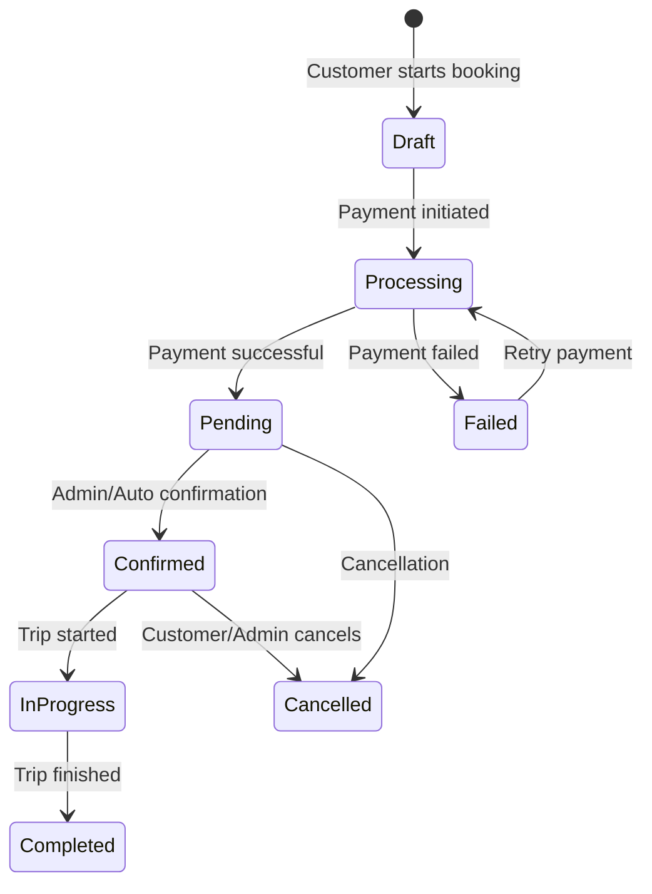
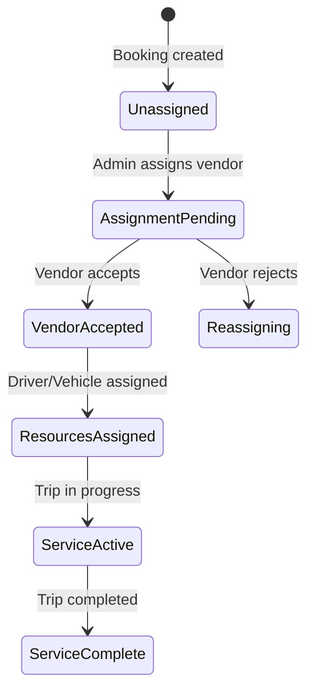
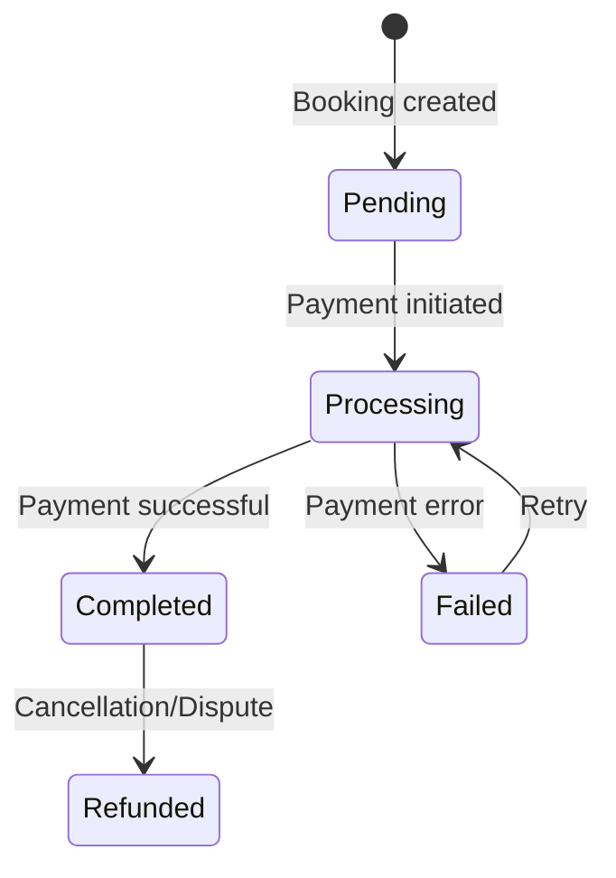

# Customer Booking Process Documentation

## Table of Contents
1. [Overview](#overview)
2. [Booking Creation Flow](#booking-creation-flow)
3. [Booking Management](#booking-management)
4. [Assignment Visibility](#assignment-visibility)
5. [Database Schema](#database-schema)
6. [Customer Actions](#customer-actions)
7. [UI Components](#ui-components)
8. [Business Rules](#business-rules)
9. [Status Flow](#status-flow)
10. [Integration Points](#integration-points)

## Overview

The Customer Booking Process is the core user journey that enables customers to:
- Search for available transfer services
- Select vehicles and specify requirements
- Complete bookings with secure payment
- Track booking status and assignments
- View service provider details
- Manage their booking history

### Customer Journey Map

```
Homepage Search
    ↓
Vehicle Selection
    ↓
Checkout & Payment
    ↓
Booking Confirmation
    ↓
Assignment Notification
    ↓
Service Delivery
    ↓
Trip Completion
```

## Booking Creation Flow

### 1. Location Selection

Customers begin their journey by selecting:
- **Pickup Location**: From predefined locations or custom address
- **Dropoff Location**: Destination selection
- **Date & Time**: Pickup schedule

### 2. Vehicle Type Selection

Based on route and requirements:
- View available vehicle types
- Compare capacity and features
- See zone-based pricing
- Select appropriate vehicle

### 3. Checkout Process

**Location**: `/checkout/page.tsx`

#### Authentication Check
```typescript
// Redirect non-authenticated users to login
if (!user) {
  const returnUrl = `/checkout?${searchParams}`
  redirect(`/auth/checkout-login?returnUrl=${returnUrl}`)
}

// Only customers can create bookings
if (profile.role !== 'customer') {
  redirect(`/${profile.role}/dashboard?error=${role} users cannot make bookings`)
}
```

#### Checkout Form Fields

| Field | Type | Required | Description |
|-------|------|----------|-------------|
| `firstName` | string | Yes | Primary passenger first name |
| `lastName` | string | Yes | Primary passenger last name |
| `email` | string | Yes | Contact email |
| `phone` | string | Yes | Contact phone (min 10 digits) |
| `passengerCount` | number | Yes | Number of passengers (1-50) |
| `luggageCount` | number | Yes | Number of luggage pieces (0-50) |
| `specialRequests` | string | No | Special instructions |
| `childSeats.infant` | number | No | Infant seats needed (0-4) |
| `childSeats.booster` | number | No | Booster seats needed (0-4) |
| `extraLuggageCount` | number | No | Extra luggage pieces |
| `agreeToTerms` | boolean | Yes | Terms acceptance |
| `paymentMethod` | enum | Yes | Payment type (card) |

### 4. Booking Creation

**Function**: `createBooking()` in `/app/checkout/actions.ts`

```typescript
// Booking creation process
1. Validate customer authentication
2. Check customer role eligibility
3. Generate unique booking number
4. Calculate pricing:
   - Base price from zone pricing
   - Child seat pricing ($10 each)
   - Extra luggage pricing ($15 per piece)
   - Total = base + amenities
5. Create booking record
6. Add passenger details
7. Record amenities
8. Trigger payment process
```

### 5. Payment Processing

- Stripe integration for secure payments
- Payment intent creation
- Real-time payment status updates
- Automatic booking confirmation on successful payment

## Booking Management

### Customer Bookings Dashboard

**Location**: `/app/customer/bookings/page.tsx`

#### Dashboard Statistics
- **Total Bookings**: All-time booking count
- **Upcoming**: Confirmed future bookings
- **Completed**: Successfully finished trips
- **Cancelled**: Cancelled booking count

#### Booking List Features
- Paginated view (10 per page)
- Search by booking number or addresses
- Filter by status and payment status
- Date range filtering
- Sortable columns

#### Booking Information Display
```typescript
// Each booking shows:
- Booking number
- Pickup date/time
- Route (pickup → dropoff)
- Vehicle type
- Passenger count
- Total price
- Booking status
- Payment status
- Assignment status (if assigned)
```

### Booking Detail View

**Location**: `/app/customer/bookings/[id]/page.tsx`

#### Sections Displayed

1. **Header Information**
   - Booking number
   - Creation date
   - Print/Download options

2. **Status Cards**
   - Booking status badge
   - Payment status with amount

3. **Journey Details**
   - Date and time
   - Passenger count
   - Luggage count
   - Pickup address
   - Dropoff address

4. **Service Provider Details** (when assigned)
   - Vendor business name
   - Driver information
   - Vehicle details
   - Contact information

5. **Payment Summary**
   - Base price breakdown
   - Amenities pricing
   - Total amount
   - Payment confirmation

6. **Available Actions**
   - View receipt
   - Complete payment (if pending)
   - Cancel booking (if eligible)
   - Contact support

## Assignment Visibility

### How Customers See Assignments

When an admin assigns a booking to a vendor, customers can see:

#### Assignment States

1. **No Assignment**
   - No vendor information shown
   - Booking status shows as "pending"

2. **Pending Assignment**
   ```
   Status: Assignment in progress
   Message: "Service provider assignment in progress"
   Icon: Clock indicator
   ```

3. **Accepted Assignment**
   ```
   Vendor: [Business Name]
   Contact: [Business Phone]
   Status: Accepted
   ```

4. **Resources Assigned**
   ```
   Driver: [Name]
   Phone: [Contact Number]
   Vehicle: [Make Model Year]
   Registration: [Number]
   ```

### Real-time Updates

Customers receive updates when:
- Booking is assigned to vendor
- Vendor accepts assignment
- Driver and vehicle are assigned
- Trip status changes
- Payment is processed

### Service Provider Information

```typescript
interface ServiceProviderDisplay {
  vendor: {
    business_name: string
    business_phone?: string
    business_email?: string
  }
  driver?: {
    first_name: string
    last_name: string
    phone: string
  }
  vehicle?: {
    make: string
    model: string
    year: number
    registration_number: string
  }
}
```

## Database Schema

### Customer-Relevant Tables

#### bookings Table (Customer View)
```sql
-- Fields visible/relevant to customers
booking_number TEXT -- Unique identifier
customer_id UUID -- Links to customer profile
pickup_datetime TIMESTAMPTZ -- Scheduled pickup
pickup_address TEXT -- Pickup location
dropoff_address TEXT -- Destination
passenger_count INTEGER -- Number of passengers
luggage_count INTEGER -- Luggage pieces
total_price DECIMAL -- Total cost
booking_status TEXT -- Current status
payment_status TEXT -- Payment state
customer_notes TEXT -- Special requests
created_at TIMESTAMPTZ -- Booking date
```

#### booking_passengers Table
```sql
-- Primary passenger information
booking_id UUID -- Links to booking
first_name TEXT
last_name TEXT
email TEXT
phone TEXT
is_primary BOOLEAN -- Primary contact flag
```

#### booking_amenities Table
```sql
-- Additional services
booking_id UUID
amenity_type TEXT -- child_seat_infant, child_seat_booster, extra_luggage
quantity INTEGER
price DECIMAL
```

#### booking_assignments View (Customer Perspective)
```sql
-- What customers can see about assignments
vendor_business_name TEXT
assignment_status TEXT
driver_name TEXT
driver_phone TEXT
vehicle_details TEXT
accepted_at TIMESTAMPTZ
```

## Customer Actions

### Primary Actions

#### 1. Create Booking
```typescript
async function createBooking(formData: BookingFormData) {
  // Validate customer role
  // Generate booking number
  // Calculate pricing
  // Create booking record
  // Add passenger details
  // Record amenities
  // Initialize payment
}
```

#### 2. View Bookings
```typescript
// Customer can:
- View all their bookings
- Filter by status
- Search by booking number
- View detailed information
- Download invoices
```

#### 3. Cancel Booking
```typescript
// Cancellation eligibility:
canCancel =
  !isPastBooking &&
  booking.status === 'confirmed' &&
  (pickupTime - currentTime) > 24 hours
```

#### 4. Contact Support
- In-app support requests
- Direct phone contact to vendor (when assigned)
- Email support tickets

### Secondary Actions

- Print booking details
- Download PDF receipt
- View payment history
- Update contact information
- Leave feedback (after completion)

## UI Components

### Checkout Components

#### ProgressBar Component
Shows three-step process:
1. Select Route
2. Choose Vehicle
3. Complete Booking

#### CheckoutWrapper Component
Main container managing:
- Form state
- Validation
- Price calculation
- Payment initiation

#### BookingForm Component
Handles:
- Passenger information
- Contact details
- Special requirements
- Amenities selection
- Terms acceptance

#### OrderSummary Component
Displays:
- Route details
- Vehicle information
- Price breakdown
- Total amount

### Customer Dashboard Components

#### BookingsTable Component
Features:
- Responsive design
- Status badges
- Quick actions
- Mobile-optimized view

#### BookingFilters Component
Provides:
- Search input
- Status dropdown
- Date pickers
- Clear filters option

#### BookingDetailCard Component
Shows:
- Complete booking information
- Assignment details
- Payment summary
- Action buttons

### Status Indicators

#### Booking Status Badges
- **Pending**: Gray with clock icon
- **Confirmed**: Green with check icon
- **Completed**: Blue with check icon
- **Cancelled**: Red with X icon

#### Payment Status Badges
- **Processing**: Blue with spinner
- **Completed**: Green with check
- **Failed**: Red with X
- **Refunded**: Orange with alert

#### Assignment Status
- **Not Assigned**: No indicator
- **Pending**: Yellow badge
- **Accepted**: Green badge with vendor name
- **Driver Assigned**: Green with driver details

## Business Rules

### Booking Creation Rules

1. **Customer Eligibility**
   - Must be authenticated
   - Must have 'customer' role
   - Profile must be complete

2. **Booking Validation**
   - Pickup must be future date/time
   - Passenger count within vehicle capacity
   - Valid contact information required
   - Terms must be accepted

3. **Pricing Rules**
   - Base price from zone pricing matrix
   - Vehicle type multiplier applied
   - Amenities added to base price
   - No hidden fees

### Cancellation Policy

```typescript
const cancellationRules = {
  freeWindow: 24, // hours before pickup
  partialRefundWindow: 6, // hours before pickup
  refundPercentages: {
    moreThan24Hours: 100,
    between6And24Hours: 50,
    lessThan6Hours: 0
  }
}
```

### Modification Rules

1. **Before Assignment**
   - Can modify pickup time
   - Can change passenger count
   - Can update contact info

2. **After Assignment**
   - Contact vendor for changes
   - May incur additional charges
   - Subject to vendor approval

### Payment Requirements

1. **Payment Timing**
   - Due at booking creation
   - Must complete before confirmation

2. **Payment Methods**
   - Credit/Debit cards via Stripe
   - Secure tokenization
   - PCI compliant

3. **Refund Policy**
   - Automatic for cancellations (per policy)
   - Manual review for disputes
   - Processed within 5-7 business days

## Status Flow

### Customer Booking Lifecycle



### Assignment Visibility States



### Payment Status Flow



## Integration Points

### Payment Gateway (Stripe)

1. **Payment Flow**
   ```typescript
   // Customer initiates payment
   createPaymentIntent(amount, bookingId)
   // Stripe processes payment
   handlePaymentWebhook(event)
   // Update booking status
   updatePaymentStatus(bookingId, status)
   ```

2. **Webhook Events**
   - payment_intent.succeeded
   - payment_intent.failed
   - charge.refunded

### Email Notifications

Customers receive emails for:
- Booking confirmation
- Payment receipt
- Assignment notification
- Driver details
- Trip reminders (24 hours before)
- Cancellation confirmation
- Refund confirmation

### SMS Notifications

Optional SMS updates for:
- Booking confirmation (short)
- Driver assignment
- Driver arrival
- Trip completion

### Real-time Updates

1. **WebSocket Events**
   ```typescript
   // Customer subscribes to booking updates
   socket.on('booking:${bookingId}:status', (data) => {
     updateBookingStatus(data)
   })

   socket.on('booking:${bookingId}:assignment', (data) => {
     showAssignmentDetails(data)
   })
   ```

2. **Push Notifications**
   - Browser notifications for status changes
   - Mobile app push for critical updates

### Customer Support Integration

1. **In-app Chat**
   - Direct messaging with support
   - Booking context included
   - File attachments supported

2. **Phone Support**
   - Click-to-call vendor (when assigned)
   - Support hotline integration

3. **Ticket System**
   - Create support tickets
   - Track resolution status
   - Email updates

## Error Handling

### Common Customer Errors

1. **Booking Creation Errors**
   ```typescript
   try {
     await createBooking(formData)
   } catch (error) {
     // Handle specific cases:
     if (error.code === 'ROLE_INVALID') {
       showError('Only customers can create bookings')
     } else if (error.code === 'PAYMENT_FAILED') {
       showError('Payment processing failed. Please try again.')
     } else {
       showError('Unable to create booking. Please contact support.')
     }
   }
   ```

2. **Payment Errors**
   - Card declined
   - Insufficient funds
   - Network timeout
   - Invalid card details

3. **Validation Errors**
   - Invalid pickup time (past)
   - Exceeds vehicle capacity
   - Missing required fields

### Error Recovery

1. **Payment Retry**
   - Automatic retry for network issues
   - Manual retry option for failures
   - Alternative payment method

2. **Booking Recovery**
   - Save draft bookings
   - Resume interrupted sessions
   - Restore from browser storage

## Accessibility & UX

### Mobile Optimization

1. **Responsive Design**
   - Touch-friendly controls
   - Simplified navigation
   - Optimized forms
   - Readable typography

2. **Progressive Enhancement**
   - Works without JavaScript
   - Enhances with features
   - Offline capability

### Accessibility Features

1. **Screen Reader Support**
   - Semantic HTML
   - ARIA labels
   - Keyboard navigation
   - Focus management

2. **Visual Accessibility**
   - High contrast mode
   - Color blind friendly
   - Scalable text
   - Clear indicators

### User Experience

1. **Booking Flow**
   - Minimal steps
   - Clear progress indication
   - Auto-save progress
   - Easy navigation

2. **Information Architecture**
   - Logical grouping
   - Clear labeling
   - Consistent patterns
   - Helpful tooltips

## Performance Considerations

### Page Load Optimization

1. **Code Splitting**
   - Lazy load components
   - Route-based splitting
   - Dynamic imports

2. **Data Fetching**
   - Server-side rendering
   - Incremental static regeneration
   - Optimistic updates

### Caching Strategy

1. **Browser Caching**
   - Static assets
   - API responses
   - Form data

2. **Server Caching**
   - Location data
   - Vehicle types
   - Pricing information

## Security Measures

### Data Protection

1. **Personal Information**
   - Encrypted transmission
   - Secure storage
   - Limited access

2. **Payment Security**
   - PCI compliance
   - Tokenization
   - Secure checkout

### Authentication

1. **Session Management**
   - Secure cookies
   - Token expiration
   - Multi-factor authentication

2. **Authorization**
   - Role-based access
   - Resource ownership
   - Action validation

## Related Documentation

- [Admin Booking Assignment](./admin-booking-assignment.md)
- [Vendor Driver and Booking Assignment](./vendor-driver-booking-assignment.md)
- [Payment Processing](./payment-processing.md)
- [Notification System](./notification-system.md)