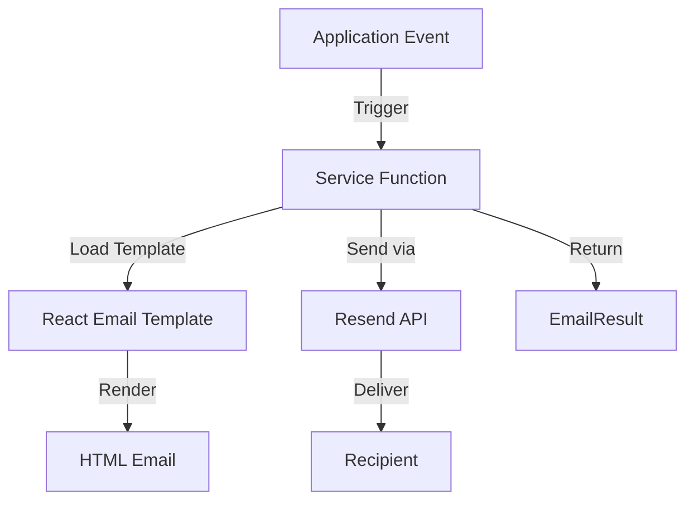

# Email System Documentation

## Table of Contents
1. [Overview](#overview)
2. [Email Service Provider](#email-service-provider)
3. [Architecture](#architecture)
4. [Configuration](#configuration)
5. [Email Types](#email-types)
6. [Templates & Components](#templates--components)
7. [Implementation Guide](#implementation-guide)
8. [Usage Examples](#usage-examples)
9. [Environment Setup](#environment-setup)
10. [Troubleshooting](#troubleshooting)

## Overview

The Vehicle Service application uses a comprehensive email system built with Resend API and React Email for sending transactional emails. The system supports multiple email types for authentication, bookings, and vendor management workflows.

### Key Features
- **Transactional Email Delivery**: Powered by Resend API
- **React-based Templates**: Type-safe email templates using React Email
- **Multiple Email Categories**: Authentication, Booking, and Vendor emails
- **Reusable Components**: Shared components for consistent email design
- **Error Handling**: Comprehensive error handling and logging
- **Type Safety**: Full TypeScript support with type definitions

### Email Categories

1. **Authentication Emails**
   - Welcome email with verification link
   - Email verification
   - Password reset

2. **Booking Emails**
   - Booking confirmation
   - Booking status updates
   - Booking assignments (for vendors)

3. **Vendor Emails**
   - Application received confirmation
   - Application approved notification
   - Application rejected notification

## Email Service Provider

### Resend

The application uses **Resend** as the email service provider for reliable transactional email delivery.

**Why Resend?**
- Simple, modern API
- React Email support
- High deliverability rates
- Developer-friendly
- Generous free tier

**Official Documentation**: [resend.com/docs](https://resend.com/docs)

## Architecture

### Directory Structure

```
lib/email/
├── config.ts                    # Configuration and client initialization
├── types.ts                     # TypeScript type definitions
├── services/
│   ├── auth-emails.ts          # Authentication email services
│   ├── booking-emails.ts       # Booking email services
│   └── vendor-emails.ts        # Vendor email services
├── templates/
│   ├── base/
│   │   ├── layout.tsx          # Base email layout
│   │   └── button.tsx          # Reusable button component
│   ├── auth/
│   │   ├── welcome.tsx         # Welcome email template
│   │   ├── verification.tsx    # Verification email template
│   │   └── password-reset.tsx  # Password reset template
│   ├── booking/
│   │   ├── confirmation.tsx    # Booking confirmation template
│   │   └── status-update.tsx   # Status update template
│   └── vendor/
│       ├── application-received.tsx
│       ├── application-approved.tsx
│       └── application-rejected.tsx
├── components/
│   ├── info-box.tsx            # Info box component
│   ├── details-section.tsx     # Details section component
│   └── list.tsx                # List component
├── styles/
│   └── constants.ts            # Style constants and theme
└── utils/
    └── preview-data.ts         # Preview data for development
```

### Email Flow Diagram



## Configuration

### Environment Variables

Required environment variables in `.env.local`:

```env
# Resend API Configuration
RESEND_API_KEY=re_xxxxxxxxxxxxx
RESEND_FROM_EMAIL=noreply@yourdomain.com
RESEND_REPLY_TO_EMAIL=support@yourdomain.com

# Application URL
NEXT_PUBLIC_APP_URL=http://localhost:3001
```

### Configuration File

**File**: `lib/email/config.ts`

```typescript
import { Resend } from 'resend';

// Lazy initialization of Resend client
let resendClient: Resend | null = null;

export const getResendClient = (): Resend => {
  if (resendClient) {
    return resendClient;
  }

  if (!process.env.RESEND_API_KEY) {
    throw new Error('RESEND_API_KEY is not defined');
  }

  resendClient = new Resend(process.env.RESEND_API_KEY);
  return resendClient;
};

export const getEmailConfig = () => {
  if (!process.env.RESEND_FROM_EMAIL) {
    throw new Error('RESEND_FROM_EMAIL is not defined');
  }

  return {
    from: process.env.RESEND_FROM_EMAIL,
    replyTo: process.env.RESEND_REPLY_TO_EMAIL || process.env.RESEND_FROM_EMAIL,
  };
};

export const getAppUrl = (): string => {
  if (process.env.NEXT_PUBLIC_APP_URL) {
    return process.env.NEXT_PUBLIC_APP_URL;
  }

  if (process.env.NODE_ENV === 'development') {
    return 'http://localhost:3001';
  }

  return 'https://yourdomain.com';
};
```

## Email Types

### 1. Authentication Emails

#### Welcome Email
**Service**: `sendWelcomeEmail()`
**File**: `lib/email/services/auth-emails.ts`
**Template**: `lib/email/templates/auth/welcome.tsx`

Sent when a new user registers. Includes email verification link.

**Data Structure**:
```typescript
interface WelcomeEmailData {
  email: string;
  name: string;
  verificationUrl: string;
}
```

#### Email Verification
**Service**: `sendVerificationEmail()`
**Template**: `lib/email/templates/auth/verification.tsx`

Sent when user requests email verification.

**Data Structure**:
```typescript
interface VerificationEmailData {
  email: string;
  name: string;
  verificationUrl: string;
}
```

#### Password Reset
**Service**: `sendPasswordResetEmail()`
**Template**: `lib/email/templates/auth/password-reset.tsx`

Sent when user requests password reset.

**Data Structure**:
```typescript
interface PasswordResetEmailData {
  email: string;
  name: string;
  resetUrl: string;
}
```

### 2. Booking Emails

#### Booking Confirmation
**Service**: `sendBookingConfirmationEmail()`
**File**: `lib/email/services/booking-emails.ts`
**Template**: `lib/email/templates/booking/confirmation.tsx`

Sent when a booking is successfully created.

**Data Structure**:
```typescript
interface BookingConfirmationEmailData {
  bookingId: string;
  customerName: string;
  customerEmail: string;
  vehicleCategory: string;
  pickupLocation: string;
  dropoffLocation: string;
  pickupDate: string;
  pickupTime: string;
  dropoffDate: string;
  dropoffTime: string;
  totalAmount: number;
  currency: string;
  bookingReference: string;
}
```

#### Booking Status Update
**Service**: `sendBookingStatusUpdateEmail()`
**Template**: `lib/email/templates/booking/status-update.tsx`

Sent when booking status changes.

**Data Structure**:
```typescript
interface BookingStatusUpdateEmailData {
  bookingId: string;
  customerName: string;
  customerEmail: string;
  bookingReference: string;
  previousStatus: string;
  newStatus: string;
  statusMessage?: string;
  vehicleCategory: string;
  pickupDate: string;
}
```

### 3. Vendor Emails

#### Application Received
**Service**: `sendVendorApplicationReceivedEmail()`
**File**: `lib/email/services/vendor-emails.ts`
**Template**: `lib/email/templates/vendor/application-received.tsx`

Sent when vendor submits application.

**Data Structure**:
```typescript
interface VendorApplicationReceivedEmailData {
  email: string;
  name: string;
  applicationReference: string;
  submittedDate: string;
}
```

#### Application Approved
**Service**: `sendVendorApplicationApprovedEmail()`
**Template**: `lib/email/templates/vendor/application-approved.tsx`

Sent when vendor application is approved.

**Data Structure**:
```typescript
interface VendorApplicationApprovedEmailData {
  email: string;
  name: string;
  applicationReference: string;
  loginUrl: string;
  dashboardUrl: string;
}
```

#### Application Rejected
**Service**: `sendVendorApplicationRejectedEmail()`
**Template**: `lib/email/templates/vendor/application-rejected.tsx`

Sent when vendor application is rejected.

**Data Structure**:
```typescript
interface VendorApplicationRejectedEmailData {
  email: string;
  name: string;
  applicationReference: string;
  rejectionReason: string;
  reapplyUrl?: string;
}
```

## Templates & Components

### Base Layout

**File**: `lib/email/templates/base/layout.tsx`

The base layout provides consistent styling and structure for all emails.

**Features**:
- Responsive design
- Consistent branding
- Header and footer sections
- Mobile-friendly

### Reusable Components

#### Button Component
**File**: `lib/email/templates/base/button.tsx`

Consistent call-to-action buttons across all emails.

#### Info Box Component
**File**: `lib/email/components/info-box.tsx`

Highlighted information boxes for important details.

#### Details Section Component
**File**: `lib/email/components/details-section.tsx`

Formatted sections for displaying structured information.

#### List Component
**File**: `lib/email/components/list.tsx`

Styled lists for email content.

### Style Constants

**File**: `lib/email/styles/constants.ts`

Centralized style definitions for:
- Colors
- Typography
- Spacing
- Borders
- Responsive breakpoints

## Implementation Guide

### 1. Creating a New Email Service

**Step 1**: Define the data type in `lib/email/types.ts`

```typescript
export interface MyNewEmailData {
  recipientEmail: string;
  recipientName: string;
  // ... other required fields
}
```

**Step 2**: Create the email template in `lib/email/templates/category/my-email.tsx`

```tsx
import { EmailLayout } from '../base/layout';
import { Button } from '../base/button';

interface MyEmailProps {
  recipientName: string;
  // ... other props
}

export default function MyEmail({ recipientName, ...props }: MyEmailProps) {
  return (
    <EmailLayout>
      <h1>Hello {recipientName}</h1>
      {/* Email content */}
      <Button href="https://example.com">Click Here</Button>
    </EmailLayout>
  );
}
```

**Step 3**: Create the service function in `lib/email/services/category-emails.ts`

```typescript
'use server';

import { jsx } from 'react/jsx-runtime';
import { getResendClient, getEmailConfig } from '../config';
import { type EmailResult, type MyNewEmailData } from '../types';
import MyEmail from '../templates/category/my-email';

export async function sendMyNewEmail(
  data: MyNewEmailData
): Promise<EmailResult> {
  try {
    const resend = getResendClient();
    const emailConfig = getEmailConfig();

    const { data: emailData, error } = await resend.emails.send({
      from: emailConfig.from,
      to: data.recipientEmail,
      replyTo: emailConfig.replyTo,
      subject: 'Email Subject',
      react: jsx(MyEmail, {
        recipientName: data.recipientName,
        // ... other props
      }),
    });

    if (error) {
      console.error('Failed to send email:', error);
      return {
        success: false,
        error: error.message || 'Failed to send email',
      };
    }

    return {
      success: true,
      emailId: emailData?.id,
    };
  } catch (error) {
    console.error('Unexpected error sending email:', error);
    return {
      success: false,
      error: 'An unexpected error occurred',
    };
  }
}
```

### 2. Using Email Services

**Example: Send welcome email on registration**

```typescript
import { sendWelcomeEmail } from '@/lib/email/services/auth-emails';
import { getAppUrl } from '@/lib/email/config';

// In your registration action
const verificationToken = generateToken();
const verificationUrl = `${getAppUrl()}/verify-email?token=${verificationToken}`;

const emailResult = await sendWelcomeEmail({
  email: user.email,
  name: user.full_name,
  verificationUrl,
});

if (!emailResult.success) {
  console.error('Failed to send welcome email:', emailResult.error);
  // Handle error (optional - don't fail registration)
}
```

## Usage Examples

### Authentication Flow

```typescript
// app/(auth)/register/actions.ts
import { sendWelcomeEmail } from '@/lib/email/services/auth-emails';

export async function registerUser(data: RegisterData) {
  // ... create user in database

  // Generate verification token
  const token = randomBytes(32).toString('hex');
  const verificationUrl = `${getAppUrl()}/verify-email?token=${token}`;

  // Send welcome email
  const emailResult = await sendWelcomeEmail({
    email: data.email,
    name: data.full_name,
    verificationUrl,
  });

  if (!emailResult.success) {
    console.error('Email failed:', emailResult.error);
  }

  return { success: true };
}
```

### Booking Confirmation

```typescript
// app/api/bookings/create/route.ts
import { sendBookingConfirmationEmail } from '@/lib/email/services/booking-emails';

export async function createBooking(bookingData) {
  // ... create booking in database

  const emailResult = await sendBookingConfirmationEmail({
    customerName: booking.customer_name,
    customerEmail: booking.customer_email,
    bookingReference: booking.reference,
    vehicleCategory: booking.vehicle_category,
    pickupLocation: booking.pickup_location,
    dropoffLocation: booking.dropoff_location,
    pickupDate: booking.pickup_date,
    pickupTime: booking.pickup_time,
    dropoffDate: booking.dropoff_date,
    dropoffTime: booking.dropoff_time,
    totalAmount: booking.total_amount,
    currency: 'USD',
  });

  return { success: true, booking };
}
```

### Vendor Application Flow

```typescript
// app/admin/vendor-applications/[id]/actions.ts
import {
  sendVendorApplicationApprovedEmail,
  sendVendorApplicationRejectedEmail
} from '@/lib/email/services/vendor-emails';

export async function approveVendorApplication(applicationId: string) {
  // ... update application status in database

  const emailResult = await sendVendorApplicationApprovedEmail({
    email: application.email,
    name: application.name,
    applicationReference: application.reference,
    loginUrl: `${getAppUrl()}/login`,
    dashboardUrl: `${getAppUrl()}/vendor/dashboard`,
  });

  return { success: true };
}

export async function rejectVendorApplication(
  applicationId: string,
  reason: string
) {
  // ... update application status

  const emailResult = await sendVendorApplicationRejectedEmail({
    email: application.email,
    name: application.name,
    applicationReference: application.reference,
    rejectionReason: reason,
    reapplyUrl: `${getAppUrl()}/vendor/apply`,
  });

  return { success: true };
}
```

## Environment Setup

### Development Setup

1. **Get Resend API Key**:
   - Sign up at [resend.com](https://resend.com)
   - Create a new API key from dashboard
   - Use test mode for development

2. **Configure Environment Variables**:

```env
# .env.local
RESEND_API_KEY=re_123456789_test_key
RESEND_FROM_EMAIL=onboarding@resend.dev
NEXT_PUBLIC_APP_URL=http://localhost:3001
```

3. **Test Email Delivery**:
   - In development, Resend delivers to verified email addresses only
   - Add your test email to Resend dashboard
   - Check email delivery in Resend logs

### Production Setup

1. **Domain Verification**:
   - Add your domain in Resend dashboard
   - Add DNS records (SPF, DKIM, DMARC)
   - Wait for verification

2. **Production Environment Variables**:

```env
RESEND_API_KEY=re_production_key
RESEND_FROM_EMAIL=noreply@yourdomain.com
RESEND_REPLY_TO_EMAIL=support@yourdomain.com
NEXT_PUBLIC_APP_URL=https://yourdomain.com
```

3. **Email Deliverability**:
   - Use verified domain
   - Configure SPF, DKIM, DMARC records
   - Monitor bounce and complaint rates
   - Implement email validation

## Troubleshooting

### Common Issues

#### 1. Email Not Sending

**Problem**: `RESEND_API_KEY is not defined` error

**Solution**:
```bash
# Check environment variables are set
echo $RESEND_API_KEY

# Ensure .env.local exists with correct values
# Restart development server after adding env vars
```

#### 2. Email Delivered but Not Received

**Problem**: Email sent successfully but not in inbox

**Solutions**:
- Check spam/junk folder
- Verify recipient email in Resend dashboard (development)
- Check Resend logs for delivery status
- Verify domain DNS records (production)

#### 3. Template Rendering Issues

**Problem**: Email template not rendering correctly

**Solutions**:
- Check React component syntax
- Verify all required props are passed
- Test template in Resend preview
- Check for TypeScript errors

#### 4. CORS or Server Errors

**Problem**: Email service fails in server actions

**Solutions**:
```typescript
// Ensure using 'use server' directive
'use server';

// Use proper async/await
export async function sendEmail(data) {
  try {
    const result = await sendWelcomeEmail(data);
    return result;
  } catch (error) {
    console.error('Email error:', error);
    return { success: false, error: 'Failed to send' };
  }
}
```

### Debugging Tips

1. **Enable Detailed Logging**:
```typescript
export async function sendEmail(data: EmailData) {
  console.log('Sending email to:', data.email);
  console.log('Using template:', 'WelcomeEmail');

  const result = await sendWelcomeEmail(data);

  console.log('Email result:', result);
  return result;
}
```

2. **Check Resend Dashboard**:
   - View sent emails
   - Check delivery status
   - View bounce/complaint rates
   - Monitor API usage

3. **Test Templates Locally**:
```typescript
// Create a test page to preview emails
import WelcomeEmail from '@/lib/email/templates/auth/welcome';

export default function EmailPreview() {
  return (
    <WelcomeEmail
      name="Test User"
      verificationUrl="http://localhost:3001/verify"
    />
  );
}
```

### Error Codes

| Error Code | Description | Solution |
|------------|-------------|----------|
| `invalid_api_key` | API key is invalid or expired | Check RESEND_API_KEY in env |
| `validation_error` | Email data validation failed | Verify all required fields |
| `not_found` | Template or resource not found | Check file paths |
| `rate_limit_exceeded` | Too many requests | Implement rate limiting |
| `unverified_domain` | Domain not verified | Complete domain verification |

### Best Practices

1. **Error Handling**:
   - Always handle email failures gracefully
   - Don't fail critical operations if email fails
   - Log errors for debugging
   - Provide user feedback when appropriate

2. **Performance**:
   - Send emails asynchronously
   - Don't block user operations
   - Use background jobs for bulk emails
   - Implement retry logic for failures

3. **Security**:
   - Never expose API keys in client code
   - Validate all email data before sending
   - Sanitize user input in templates
   - Use environment variables for sensitive data

4. **Testing**:
   - Test all email templates
   - Verify links work correctly
   - Check responsive design
   - Test in multiple email clients

## Related Documentation

- [Authentication and Roles](./authentication-and-roles.md)
- [Booking Module](./booking-module.md)
- [Vendor Process](./vendor-process.md)
- [Resend Documentation](https://resend.com/docs)
- [React Email Documentation](https://react.email)
